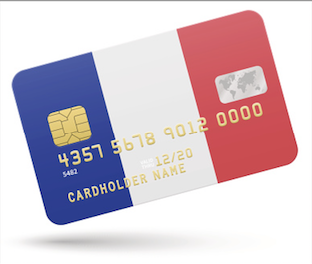

# Case Study - Classification
## Why are customers refusing credit cards? What can we do about it?
Mid-course project: Data Analytics Ironhack Bootcamp, Remote - May 2023  

Team Mon Amour:  
- Hugo Pabst
- Rachelle Flores
- Cormac O'Keefe

## Problem to solve
Lorem

## Key findings
### Segments
- We identifed five criterai for creating customer segments
2. Credit rating
3. Income level
4. Household size
5. Rewards (cash back)
6. Communication style

### Data quality 
- We found that data quality was an impediement to predicting customer behaviour:
1. High imbalance = lower predictive precision 
2. Missing data: e.g.,  customers (age, gender, regions)

### Methods
- We found a model that had the highest degree of accuracy: 
- Random Forest: 97% prediction accuracy 
and that 
- Oversampling will continue to be useful

## General conclusions
### Recommendations & next steps
1. Retarget customers:
- With newer communication channels e.g. WhatsApp
- Couple this with demographic data

2. Target these segments:
- Poor Credit rating
- Low Income level
- Small Household size
- High appetite for Rewards (cash back)

3. Get more data on:
- Spending patterns and types of purchases (sundries vs big ticket)
- Customer personas and identities (age, region, education, gender, etc)

### Presentation 
We presented our findings on May 6 2023 and you can see the presentation here: 
[Link to Google Slides version](https://docs.google.com/presentation/d/1xXbAIinpuS4oidB5m7gwRknb2jKs5x3f483AoF_Gr7Q/edit?usp=sharing)

### Project management
You can see how we managed our work and time here: 
[Notion Kanban](https://github.com/ironhack-edu/data_mid_bootcamp_project_classification](https://www.notion.so/midproject-ironhack/d89a8a2ca6544a7ab9aa72dcf0b4d6ca?v=fde7a00499124325bc5d471099cfd5c3))

